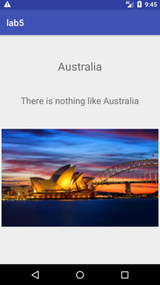

## Following are the screenshots of my applications.

### In the following screenshot, I have set aa timer of 5 secs on my seek bar i.e. UI 1.

### Below are few of the screenshots of the slideshow i.e. UI 2.

### You can go back & change the timer by using seek bar. Initially it was 5 secs & now it is 16 secs.

