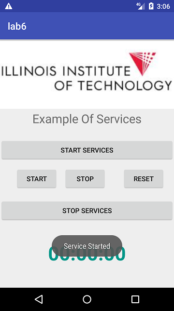
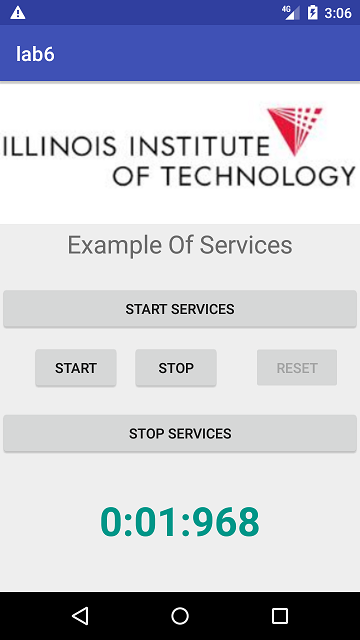
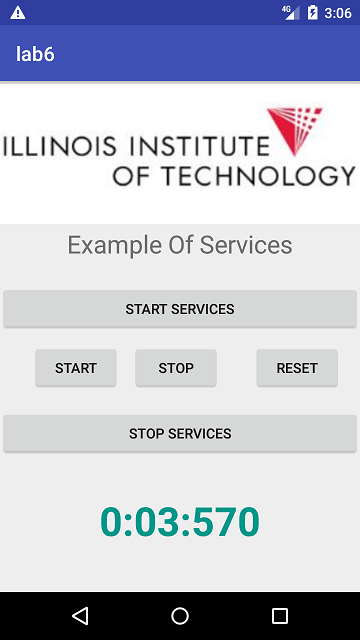
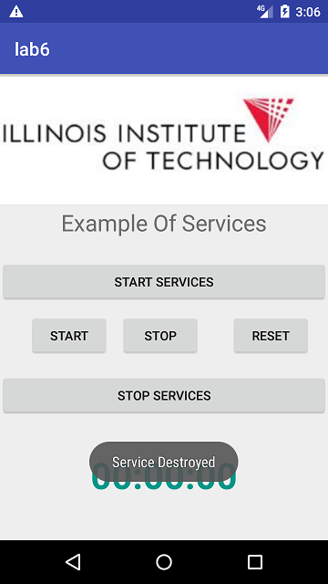

## Following are the screenshots of my applications.

### This is the GUI of the application.

### Here, I am starting the background service

### Here, i am starting the timer.

### Here, I have paused the timer & displayed the time in minutes, seconds & mili seconds.

### Here, I have reset the timer back to 00.00.00.

### Here, I am destroying the service.

